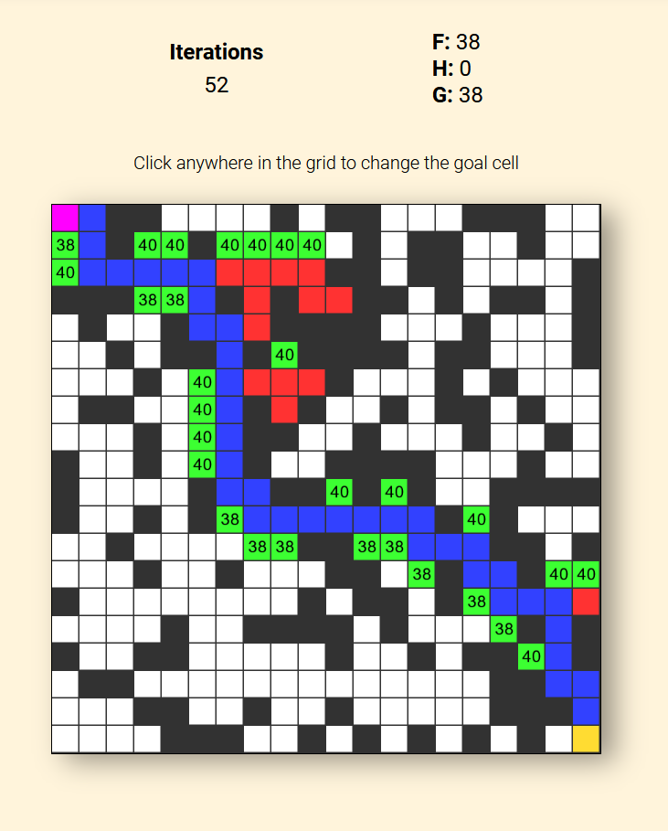

# A* (A-Star) - Pathfinding Algorithm Visualizer

Jeg har lavet en visualisering af A* pathfinding algoritmen, hvor man kan se hvordan algoritmen finder vej gennem et tilfældigt genereret grid med forhindringer til en ”mål” celle et sted i det grid. ”Mål” cellen kan selv vælges, ved at klikke hvor som helst i griddet. Derudover er der forskellige indstillingsmuligheder, såsom at kunne pause/starte visualiseringen, ændre tempoet (framerates), vælge mellem 3 forskellige størrelser af grids, og hvor mange forhindringer som der skabes i griddet. Selve visualiseringen viser hvilken celler algoritmen har besøgt (rød), hvor den potentielt vil tjekke og dens F-værdi (grøn), og den nuværende rute som den tjekker i den pågældende frame (blå). Visualisering stopper selv når vejen er fundet til den gule ”mål” celle, eller hvis der ikke er nogen mulig løsning.

## [Deployment](https://forkeh.github.io/dsa-exam-project/)
